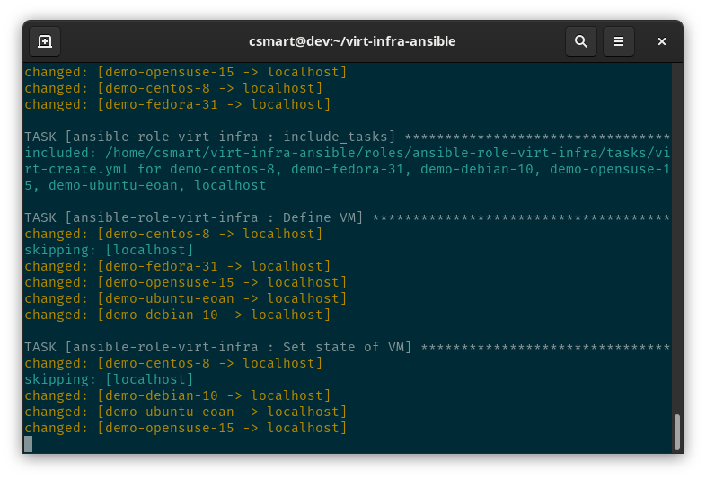

<!-- vim-markdown-toc GFM -->

* [Manage KVM networks and guests with Ansible](#manage-kvm-networks-and-guests-with-ansible)
* [Too long; didn't read](#too-long-didnt-read)
* [Too long; but gonna read anyway](#too-long-but-gonna-read-anyway)
	* [Requirements](#requirements)
		* [Get the code](#get-the-code)
		* [Ansible](#ansible)
		* [KVM](#kvm)
		* [Other tools](#other-tools)
		* [SSH keys](#ssh-keys)
		* [Guest image](#guest-image)
		* [Setup KVM host](#setup-kvm-host)
			* [Fedora](#fedora)
			* [CentOS 7](#centos-7)
			* [CentOS 8](#centos-8)
			* [Debian](#debian)
			* [Ubuntu](#ubuntu)
			* [openSUSE](#opensuse)
			* [Using routed networks](#using-routed-networks)
			* [Configuring bridges with NetworkManager](#configuring-bridges-with-networkmanager)
				* [Linux bridge](#linux-bridge)
				* [Open vSwitch (OVS) bridge](#open-vswitch-ovs-bridge)
	* [Inventory](#inventory)
		* [Defaults](#defaults)
		* [KVM host](#kvm-host)
			* [Multiple KVM hosts](#multiple-kvm-hosts)
			* [libvirt networks](#libvirt-networks)
				* [Using ovs-bridge in inventory](#using-ovs-bridge-in-inventory)
		* [Guests](#guests)
			* [Running custom shell commands on guest disk](#running-custom-shell-commands-on-guest-disk)
			* [Using Linux bridge in inventory](#using-linux-bridge-in-inventory)
			* [Using ovs-bridge in inventory](#using-ovs-bridge-in-inventory-1)
			* [Static network configuration with cloud-init](#static-network-configuration-with-cloud-init)
				* [Network device names and MAC addresses](#network-device-names-and-mac-addresses)
	* [Cloud images](#cloud-images)
	* [Running the playbook](#running-the-playbook)
		* [Cleanup](#cleanup)
	* [Post setup configuration](#post-setup-configuration)

<!-- vim-markdown-toc -->

# Manage KVM networks and guests with Ansible

This is an example Ansible playbook for my [Virtual Infrastructure Ansible
role](https://github.com/csmart/ansible-role-virt-infra).

It uses separate YAML Ansible [inventory files](#inventory) to define and
manage networks and guests on KVM hosts. Ansible's `--limit` option lets you
manage them individually or as a group.

It is really designed for dev work, where the KVM host is your local machine,
you have `sudo` and talk to `libvirtd` at `qemu:///system` however it also
works on remote hosts.

To test this out, maybe spin up a supported distro as a guest on a host that
supports nested virtualisation (CPU passthrough).



An [SVG demo is included](demo.svg), if you want to see it in action.

# Too long; didn't read

Spin up three CentOS 8 guests from _simple_ Ansible hostgroup on localhost,
using defaults.

```bash
curl -O https://cloud.centos.org/centos/8-stream/x86_64/images/CentOS-Stream-GenericCloud-8-20210603.0.x86_64.qcow2
sudo mkdir -p /var/lib/libvirt/images
sudo mv -iv CentOS-Stream-GenericCloud-8-20210603.0.x86_64.qcow2 /var/lib/libvirt/images/

git clone --recursive https://github.com/csmart/virt-infra-ansible.git
cd virt-infra-ansible

./run.sh --limit kvmhost,simple
```

# Too long; but gonna read anyway

Setting guest states to _running_, _shutdown_, _destroyed_ or _undefined_ (to
delete and clean up) are supported.

You can set whatever memory, CPU, disks and network cards you want for your
guests, either via hostgroups or individually. A mixture of multiple disks is
supported, including _scsi_, _sata_, _virtio_ and even _nvme_ (on supported
distros).

You can create private NAT libvirt networks on the KVM host and then put VMs on
any number of them. Guests can use those libvirt networks or _existing_ Linux
bridge devices (e.g. `br0`) and Open vSwitch (OVS) bridge on the KVM host (this
won't create bridges on the host, but it will check that the bridge interface
exists). You can specify the model of network card as well as the MAC for each
interface if you require, however it defaults to an idempotent address based on
the hostname.

You can also create routed libvirt networks on the KVM host and then put VMs on
any number of them. In this case, a new bridge is created with the name you
specify (e.g. `br1`), wired to an _existing_ interface (e.g. `eth0`). You can
specify the MAC for each interface if you require.

This supports various distros and uses their qcow2 [cloud
images](#guest-cloud-images) for convenience (although you could use your own
images). I've tested CentOS, Fedora, Debian, Ubuntu and openSUSE.

The qcow2 cloud base images to use for guests are specified as variables in the
inventory and should exist under libvirt images directory (default is
`/var/lib/libvirt/images/`). That is to say, this won't download the images for
you automatically.

Guest qcow2 boot images are created from those base images. By default these
use the cloud image as a backing file, however it also supports cloning
instead. You can create additional disks as you like. You can also choose to
keep any disk image rather than deleting it when a VM is undefined. The
cloud-init ISOs are created automatically and attached to the guest to
configure it on boot.

The timezone will be set to match the KVM host by default and the ansible user
will be used for the guest, along with your public SSH keys on the KVM host
(you can override that). Host entries are added to `/etc/hosts` on the KVM host
and it also modifies ansible user's SSH config and adds the fingerprint to
`known_hosts` so that you can SSH straight in (which it tests as part of the

## Requirements

All that's really needed is a Linux host capable of running KVM with `git`
installed, some guest images and a basic inventory. The Ansible will do the
rest (on supported distros).

For supported distros, the `run.sh` script will install Ansible if it is not
found. The plays will also install KVM, libvirtd and other required packages
and also make sure the libvirtd is running.

### Get the code

Once you've installed `git` on your Linux box, _recursively_ clone this repo
which will pull in the role.

```bash
git clone --recursive https://github.com/csmart/virt-infra-ansible.git
cd virt-infra-ansible
```

### Ansible

You'll probably need Ansible and Jinja >= 2.8 because this uses multiple
inventory files and things like 'equalto' comparisons.

### KVM

A working x86_64 KVM host where the user running Ansible can communicate with
libvirtd via sudo. I have tested this on CentOS 8, Fedora 31+, Debian 10, Ubuntu
Bionic/Eoan and openSUSE 15 hosts, but other Linux machines probably work.

It expects hardware support for KVM in the CPU so that we an create accelerated
guests and pass the CPU through (supports nested virtualisation).

### Other tools

Several user space tools are also required on the KVM host.

* qemu-img
* osinfo-query
* virsh
* virt-customize
* virt-sysprep

### SSH keys

At least one SSH key pair on your KVM host (run `ssh-keygen`).

### Guest image

Download the guest images you want to use ([this is what I
downloaded](#cloud-images)) and put them in libvirt images path (usually
/var/lib/libvirt/images). This will check that the images you specified exist
and error if they are not found.

### Setup KVM host

This is how you can manually configure your KVM host (this is all done
automatically on supported distros).

#### Fedora

```bash
# Create SSH key if you don't have one
ssh-keygen

# libvirtd
sudo dnf install -y @virtualization
sudo systemctl enable --now libvirtd

# Ansible
sudo dnf install -y ansible

# Other deps
sudo dnf install -y \
git \
genisoimage \
libguestfs-tools-c \
libosinfo \
python3-libvirt \
python3-lxml \
qemu-img \
virt-install
```

#### CentOS 7

CentOS 7 won't work until we have `libselinux-python3` package, which is coming in 7.8...

 * https://bugzilla.redhat.com/show_bug.cgi?id=1719978
 * https://bugzilla.redhat.com/show_bug.cgi?id=1756015

But here are (hopefully) the rest of the steps for when it is available.

```bash
# Create SSH key if you don't have one
ssh-keygen

# libvirtd
sudo yum groupinstall -y "Virtualization Host"
sudo systemctl enable --now libvirtd

# Ansible
sudo yum install -y epel-release
sudo yum install -y python36
pip3 install --user ansible

# Other deps
sudo yum install -y \
git \
genisoimage \
libguestfs-tools-c \
libosinfo \
python36-libvirt \
python36-lxml \
libselinux-python3 \
qemu-img \
virt-install
```

#### CentOS 8

```bash
# Create SSH key if you don't have one
ssh-keygen

# libvirtd
sudo dnf groupinstall -y "Virtualization Host"
sudo systemctl enable --now libvirtd

# Ansible
sudo dnf install -y epel-release
sudo dnf install -y ansible

# Other deps
sudo dnf install -y \
git \
genisoimage \
libguestfs-tools-c \
libosinfo \
python3 \
python3-libvirt \
python3-lxml \
qemu-img \
virt-install
```

#### Debian

```bash
# Create SSH key if you don't have one
ssh-keygen

# libvirtd
sudo apt update
sudo apt install -y --no-install-recommends qemu-kvm libvirt-clients libvirt-daemon-system
sudo systemctl enable --now libvirtd

# Ansible
sudo apt install -y gnupg2
echo 'deb http://ppa.launchpad.net/ansible/ansible/ubuntu trusty main' | sudo tee -a /etc/apt/sources.list
sudo apt-key adv --keyserver keyserver.ubuntu.com --recv-keys 93C4A3FD7BB9C367
sudo apt update
sudo apt install -y ansible

# Other deps
sudo apt install -y --no-install-recommends \
cloud-image-utils \
dnsmasq \
git \
genisoimage \
libguestfs-tools \
libosinfo-bin \
python3-libvirt \
python3-lxml \
qemu-utils \
virtinst
```

#### Ubuntu

```bash
 Create SSH key if you don't have one
ssh-keygen

# libvirtd
sudo apt update
sudo apt install -y --no-install-recommends libvirt-clients libvirt-daemon-system qemu-kvm
sudo systemctl enable --now libvirtd

# Ansible
sudo apt install -y software-properties-common
sudo apt-add-repository --yes --update ppa:ansible/ansible
sudo apt install -y ansible

# Other deps
sudo apt install -y --no-install-recommends \
dnsmasq \
git \
genisoimage \
libguestfs-tools \
libosinfo-bin \
python3-libvirt \
python3-lxml \
qemu-utils \
virtinst
```

#### openSUSE

If you're running JeOS, we need to change the kernel to `kernel-default` as
`kernel-default-base` which comes with JeOS is missing KVM modules.

```bash
# Create SSH key if you don't have one
ssh-keygen

# Install suitable kernel
sudo zypper install kernel-default
sudo reboot
```

Continue after reboot.

```bash
# libvirtd
sudo zypper install -yt pattern kvm_server kvm_tools
sudo systemctl enable --now libvirtd

# Ansible
sudo zypper install -y ansible

# Other deps
sudo zypper install -y \
git \
guestfs-tools \
libosinfo \
mkisofs \
python3-libvirt-python \
python3-lxml \
qemu-tools \
virt-install
```

#### Using routed networks

You can route traffic into a newly created bridge by specifying forward *type: route*.
This code supports automatic creation of a new bridge named *bridge_dev* which will be
wired onto an existing interface in the host, specified by parameter *host_dev*.

The example below shows how a bridge can be created, supporting both IPv4 and IPv6:

```yaml
kvmhost:
  hosts:
    localhost:
      ansible_connection: local
      ansible_python_interpreter: /usr/bin/python3
      virt_infra_host_libvirt_url: qemu:///system
  vars:
    virt_infra_host_networks:
      present:
        - name: example
          domain: f901.example.com
          type: route
          host_dev: eth0
          bridge_dev: virbr1
          bridge_stp: on
          bridge_delay: 0
          mac: 52:54:00:f9:01:00
          ip_address: 10.249.1.1
          ip_netmask: 255.255.255.0
          dhcp_start: 10.249.1.11
          dhcp_end: 10.249.1.254
          ip6_address: 2001:0db8::f901:1
          ip6_prefix: 64
          dhcp6_start: 2001:0db8::f901:0000
          dhcp6_end: 2001:0db8::f901:00ff
```

Notes:

1. The IPv6 block 2001:0db8/32 as shown above is provided for the sake of documentation
   purposes only. You will have to substitute that by your own delegated /48 block
   (in general) given to you by your IPv6 provider or by a IPv6 over IPv4 tunnelling
   solution such as [Hurricane Electric's tunnel broker service](http://tunnelbroker.net/).

2. It's highly recommended that you stick with *ip6_prefix: 64*, since it is the
   recommended setting in Libvirt documentation.

#### Configuring bridges with NetworkManager

This code supports connecting VMs to both Linux and Open vSwitch bridges, but
they must already exist on the KVM host.

Here is how to convert an existing ethernet device into a bridge. Be careful if
doing this on a remote machine with only one connection! Make sure you have
some other way to log in (e.g. console), or maybe add additional interfaces
instead.

First, export the the device you want to convert so we can easily reference it
later (e.g.  `eth1`).

```bash
export NET_DEV="eth1"
```

Now list the current NetworkManager connections for your device exported above
so we know what to disable later.

```bash
sudo nmcli con |egrep -w "${NET_DEV}"
```

This might be something like `System eth1` or `Wired connection 1`, let's export
it too for later reference.

```bash
export NM_NAME="Wired connection 1"
```

##### Linux bridge

Here is an example of creating a persistent Linux bridge with NetworkManager.
It will take a device such as `eth1` (substitute as appropriate) and convert it
into a bridge.

Remember your device's existing NetworkManager connection name from above, you
will use it below (e.g. `Wired connection 1`).

```bash
export NET_DEV=eth1
export NM_NAME="Wired connection 1"
sudo nmcli con add ifname br0 type bridge con-name br0
sudo nmcli con add type bridge-slave ifname "${NET_DEV}" master br0
```

OK now you have your bridge device! Note the bridge will have a different MAC
address to the underlying device, so if you're expecting it to get a specific
address, you'll need to update your DHCP static lease.

```bash
sudo ip link show dev br0
```

Disable the current NetworkManager config for the device so that it doesn't
conflict with the bridge (don't delete it yet, you may lose connection if
you're using it for SSH).

```
sudo nmcli con modify id "${NM_NAME}" ipv4.method disabled ipv6.method disabled
```

Now you can either simply `reboot`, or stop the current interface and bring up
the bridge in one command. Remember that the bridge will have a new MAC address
so it will get a new IP, unless you've updated your DHCP static leases!

```bash
sudo nmcli con down "${NM_NAME}" ; sudo nmcli con up br0
```

As mentioned above, by default the Linux bridge will get an address via DHCP.
If you don't want it to be on the network (you might have another dedicated
interface) then disable DHCP on it.

```bash
sudo nmcli con modify id br0 ipv4.method disabled ipv6.method disabled
```

##### Open vSwitch (OVS) bridge

Here is an example of creating a persistent OVS bridge with NetworkManager. It
will take a device such as `eth1` (substitute as appropriate) and convert it
into an ovs-bridge.

You will need openvswitch installed as well as the OVS NetworkManager plugin
(substitute for your distro).

```bash
sudo dnf install -y NetworkManager-ovs openvswitch
sudo systemctl enable --now openvswitch
sudo systemctl restart NetworkManager
```

Now we can create the OVS bridge (assumes your device is `eth1` and existing
NetworkManager config is `Wired connection 1`, substitute as appropriate).

```bash
export NET_DEV=eth1
export NM_NAME="Wired connection 1"
sudo nmcli con add type ovs-bridge conn.interface ovs-bridge con-name ovs-bridge
sudo nmcli con add type ovs-port conn.interface port-ovs-bridge master ovs-bridge
sudo nmcli con add type ovs-interface slave-type ovs-port conn.interface ovs-bridge master port-ovs-bridge
sudo nmcli con add type ovs-port conn.interface ovs-port-eth master ovs-bridge con-name ovs-port-eth
sudo nmcli con add type ethernet conn.interface "${NET_DEV}" master ovs-port-eth con-name ovs-int-eth
```

Disable the current NetworkManager config for the device so that it doesn't
conflict with the bridge (don't delete it yet, you may lose connection if
you're using it for SSH).

```
sudo nmcli con modify id "${NM_NAME}" ipv4.method disabled ipv6.method disabled
```

Now you can either simply `reboot`, or stop the current interface and bring up
the bridge in one command.

```bash
sudo nmcli con down "${NM_NAME}" ; sudo nmcli con up ovs-slave-ovs-bridge
```

By default the OVS bridge will get an address via DHCP. If you don't want it to
be on the network (you might have another dedicated interface) then disable
DHCP on it.

```bash
sudo nmcli con modify id ovs-slave-ovs-bridge ipv4.method disabled ipv6.method disabled
```

Show the switch config and bridge with OVS tools.

```bash
sudo ovs-vsctl show
```

## Inventory

The inventories are split into multiple files for ease of management, under the
inventories directory in this Git repo.

This includes the required core inventory for kvmhost:

* kvmhost.yml (vars for the KVM host)

And also includes two sample inventories:

* simple.yml (hostgroup for CentOS guests, using defaults)
* example.yml (hostgroup for guests using multiple distros and custom vars)

The role contains defaults so that it works mostly out of the box. You probably
just need to download the CentOS [cloud image](#cloud-images) (see [Too long;
didn't read](#too-long-didnt-read)).

Custom settings can be provided for each host or group of hosts in the
inventory.

To create a new group of guests to manage, create a new yml file under the
inventory directory. For example, if you wanted a set of guests for
OpenStack, you could create an openstack.yml file and populate it as required.

To manage specific hosts or groups, simply use Ansible's _--limit_ option to
specify the hosts or hostgroups (must also include _kvmhost_ group). This way
you can use the one inventory for lots of different guests and manage them
separately.

### Defaults

All the defaults are set in the role, which you can see at:

* roles/ansible-role-virt-infra/defaults/main.yml

The defaults should be something like this.

```yaml
---
# Defaults for virt-infra Ansible role
# Values which are commented out are optional

## Guest related

# Valid guest states are: running, shutdown, destroyed or undefined
virt_infra_state: "running"

# Guests are not autostarted on boot
virt_infra_autostart: "no"

# Guest user, by default this will be set to the same user as KVM host user
virt_infra_user: "{{ hostvars[kvmhost].ansible_env.USER }}"

# Password of default user (consider a vault if you need secure passwords)
# No root password by default
virt_infra_password: "password"
#virt_infra_root_password:

# VM specs for guests
# See virt-install manpage for supported values
virt_infra_ram: "1024"
virt_infra_ram_max: "{{ virt_infra_ram }}"
virt_infra_cpus: "1"
virt_infra_cpus_max: "{{ virt_infra_cpus }}"
virt_infra_cpu_model: "host-passthrough"
virt_infra_machine_type: "q35"

# SSH keys are a list, you can add more than one
# If not specified, we default to all public keys on KVM host
virt_infra_ssh_keys: []

# If no SSH keys are specified or found on the KVM host, we create one with this
virt_infra_ssh_key_size: "2048"
virt_infra_ssh_key_type: "rsa"

# Whether to enable SSH password auth
virt_infra_ssh_pwauth: true

# Whether to use cloud-init to configure networking on guest
virt_infra_network_config: false

# Networks are a list, you can add more than one
# "type" is optional, both "nat" and "bridge" are supported
#  - "nat" is default type and should be a libvirt network
#  - "bridge" type requires the bridge interface as the name (e.g. name: "br0") which also must already be setup on KVM host
# "model" is also optional
virt_infra_networks:
  - name: "default"
    type: "nat"
    model: "virtio"

# Disks, support various libvirt options
# We generally don't set them though and leave it to hypervisor default
# See virt-install manpage for supported values
virt_infra_disk_size: "20"
virt_infra_disk_bus: "scsi"
virt_infra_disk_io: "threads"
virt_infra_disk_cache: "writeback"

# Disks are a list, you can add more than one
# If you override this, you must still include 'boot' device first in the list
# Only 'name' is required, others are optional (default size is 20GB)
# All guests require at least a boot drive (which is the default)
virt_infra_disks:
  - name: "boot"
    size: "{{ virt_infra_disk_size }}"
    bus: "{{ virt_infra_disk_bus }}"
#   io: "{{ virt_infra_disk_io }}"
#   cache: "{{ virt_infra_disk_cache }}"

# Default distro is CentOS 8, override in guests or groups
virt_infra_distro_image: "CentOS-Stream-GenericCloud-8-20210603.0.x86_64.qcow2"

# Determine supported variants on your KVM host with command, "osinfo-query os"
# This doesn't really make much difference to the guest, maybe slightly different bus
# You could probably just set this as "centos7.0" for all distros, if you wanted to
#virt_infra_variant: "centos7.0"

# These distro vars are here for reference and convenience
virt_infra_distro: "centos"
virt_infra_distro_release: "7"
virt_infra_distro_image_url: "https://cloud.centos.org/centos/7/images/CentOS-7-x86_64-GenericCloud.qcow2"
virt_infra_distro_image_checksum_url: "https://cloud.centos.org/centos/7/images/sha256sum.txt"

## KVM host related

# Connect to system libvirt instance
virt_infra_host_libvirt_url: "qemu:///system"

# Path where disk images are kept
virt_infra_host_image_path: "/var/lib/libvirt/images"

# Disable qemu security driver by default
# This is overridden in distro specific vars
virt_infra_security_driver: "none"

# Virtual BMC is disabled by default
virt_infra_vbmc: false

# By default we install with pip, but if you prefer to do it manually, set this to false
virt_infra_vbmc_pip: true

# Default vbmc service, override if something else on your distro
virt_infra_vbmc_service: vbmcd

# Networks on kvmhost are a list, you can add more than one
# You can create and remove NAT networks on kvmhost (creating bridges not supported)
# The 'default' network is the standard one shipped with libvirt
# By default we don't remove any networks (empty absent list)
virt_infra_host_networks:
  absent: []
  present:
    - name: "default"
      type: "nat"
      ip_address: "192.168.122.1"
      subnet: "255.255.255.0"
      dhcp_start: "192.168.122.2"
      dhcp_end: "192.168.122.254"

# Command for creating ISO images
virt_infra_mkiso_cmd: genisoimage

# List of binaries to check for on KVM Host
virt_infra_host_deps:
  - qemu-img
  - osinfo-query
  - virsh
  - virt-customize
  - virt-sysprep

# Comma separated list of packages to install into guest disks
virt_infra_guest_deps:
  - cloud-init
  - qemu-guest-agent
```

Various other distro specific vars are sourced, based on the host, mostly
around dependencies to install.

### KVM host

The KVM host is defined in the kvmhost.yml inventory file as *localhost* in the
*kvmhost* hostgroup. The Ansible tasks refer to the first entry in this
hostgroup when performing tasks on the KVM host.

```yaml
---
# YAML based inventory, see:
# https://docs.ansible.com/ansible/latest/plugins/inventory/yaml.html

kvmhost:
  hosts:
    localhost:
      ansible_connection: local
```

#### Multiple KVM hosts

You can also specify multiple KVM hosts.

```yaml
---
kvmhost:
  hosts:
    kvmhost1:
    kvmhost2:
    kvmhost3:
  vars:
    ansible_python_interpreter: /usr/bin/python3
    virt_infra_host_networks:
      absent: []
      present:
        - name: "default"
          ip_address: "192.168.112.1"
          subnet: "255.255.255.0"
          dhcp_start: "192.168.112.2"
          dhcp_end: "192.168.112.254"

```

To have a VM land on a specific KVM host, you must add the variable `kvmhost`
with a string that matches a KVM host from the `kvmhost` group.

For example, six CentOS hosts across three KVM hosts:

```yaml
---
simple:
  hosts:
    simple-centos-[1:2]:
      kvmhost: kvmhost1
    simple-centos-[3:4]:
      kvmhost: kvmhost2
    simple-centos-[5:6]:
      kvmhost: kvmhost3
  vars:
    ansible_python_interpreter: /usr/libexec/platform-python
    virt_infra_distro_image: "CentOS-Stream-GenericCloud-8-20210603.0.x86_64.qcow2"
```

If no kvmhost is specified for a VM it will default to the first KVM host in
the `kvmhost` group (i.e. kvmhost[0]) which matches the original behaviour for
the role.

Validation checks have been updated to make sure that all of the KVM hosts are
valid and that any specified KVM host for a VM is in the `kvmhost` group.

To group VMs on certain KVM hosts, consider making child groups and specify

#### libvirt networks

The KVM host is where the libvirt networks are created and therefore specified
as vars under that hostgroup.

Here is an example which makes sure three networks are created (two are libvirt
managed the other is ovs) and one has been deleted.

```yaml
---
# YAML based inventory, see:
# https://docs.ansible.com/ansible/latest/plugins/inventory/yaml.html

kvmhost:
  hosts:
    localhost:
      ansible_connection: local
  vars:
    virt_infra_host_networks:
      absent:
        - name: "example-removed"
      present:
        - name: "example"
          ip_address: "172.31.255.1"
          subnet: "255.255.255.0"
          dhcp_start: "172.31.255.2"
          dhcp_end: "172.31.255.254"
          mtu: 9000
        - name: "example2"
          ip_address: "10.255.255.1"
          subnet: "255.255.255.0"
          dhcp_start: "10.255.255.2"
          dhcp_end: "10.255.255.254"
          mtu: 9000
        - name: ovs-bridge
          bridge_dev: ovs-bridge
          type: ovs
          portgroup:
            - name: ovs-trunk
              trunk: true
              native_vlan: 1
              vlan:
                - 1
                - 2
            - name: home
              native_vlan: 1
              vlan:
                - 1
            - name: guest
              native_vlan: 2
              vlan:
                - 2
```

##### Using ovs-bridge in inventory

After configuring [Open vSwitch (OVS) bridge](#open-vswitch-ovs-bridge) on your
host you can use `ovs-bridge` as the `device` of an `ovs` bridge in your
`kvmhost` inventory `virt_infra_host_networks` entry and it will create the OVS
libvirt networks for you. You can set up multiple VLANs and set one as default
native (if required).

```yaml
      virt_infra_host_networks:
        present:
          - name: ovs-bridge
            bridge_dev: ovs-bridge
            type: ovs
            portgroup:
              # This is a portgroup with multiple VLANs
              # It is native VLAN 1 and also allows traffic tagged with VLAN 99
              - name: ovs-trunk
                trunk: true
                native_vlan: 1
                vlan:
                  - 1
                  - 99
              # This is portgroup just for native VLAN 1
              - name: default
                native_vlan: 1
                vlan:
                  - 1
              # This is portgroup just for native VLAN 99
              - name: other
                native_vlan: 99
                vlan:
                  - 99
```

### Guests

Guests are defined in their own yaml files under the inventories directory. Two
samples are included by default, simple.yml and example.yml.

Here's an example hostgroup called _simple_ with three VMs, using defaults
(apart from the Python interpreter). Note that these will be CentOS 7 guests
because that's the default in default.yml.

```yaml
---
## YAML based inventory, see:
## https://docs.ansible.com/ansible/latest/plugins/inventory/yaml.html

simple:
  hosts:
    centos-simple-[0:2]:
      ansible_python_interpreter: /usr/bin/python
```

If you want a group of VMs to all be the same, set the vars at the hostgroup
level. You can still override hostgroup vars with individual vars for specific
hosts, if required.

Here's an example setting various hostgroup and individual host vars.

```yaml
---
## YAML based inventory, see:
## https://docs.ansible.com/ansible/latest/plugins/inventory/yaml.html

example:
  hosts:
    centos-7-example:
      virt_infra_state: shutdown
      virt_infra_timezone: "Australia/Melbourne"
      ansible_python_interpreter: /usr/bin/python
      virt_infra_networks:
        - name: "br0"
          type: bridge
          mtu: 9000
        - name: "extra_network"
          type: nat
          model: e1000
        - name: ovs-bridge
          portgroup: guest
          type: ovs
      virt_infra_disks:
        - name: "boot"
        - name: "nvme"
          size: "100"
          bus: "nvme"
    centos-8-example:
      virt_infra_timezone: "Australia/Melbourne"
      ansible_python_interpreter: /usr/libexec/platform-python
    opensuse-15-example:
      virt_infra_distro: opensuse
      virt_infra_distro_image: openSUSE-Leap-15.1-JeOS.x86_64-15.1.0-OpenStack-Cloud-Current.qcow2
      virt_infra_variant: opensuse15.1
      virt_infra_disks:
        - name: "boot"
          bus: "scsi"
    ubuntu-eoan-example:
      virt_infra_cpu: 2
      virt_infra_distro: ubuntu
      virt_infra_distro_image: eoan-server-cloudimg-amd64.img
      virt_infra_variant: ubuntu18.04
  vars:
    virt_infra_ram: 1024
    virt_infra_disks:
      - name: "boot"
      - name: "data"
        bus: "sata"
        keep: true
    virt_infra_networks:
      - "example"
```

#### Running custom shell commands on guest disk

Using the variable `virt_infra_disk_cmd`, you can create a list of shell
commands that you want to be run on the guest disk, before the VM is created.
These can be any shell command, and used for simple things you need to do
before the VM is created, otherwise you should do it with Ansible afterwards.

For example, setting a mirror on a Fedora guest:

```yaml
      virt_infra_disk_cmd:
        - sed -i s/^metalink/#metalink/g /etc/yum.repos.d/*repo
        - sed -i s/^#baseurl/baseurl/g /etc/yum.repos.d/*repo
        - dnf config-manager --save --setopt baseurl=http://path-to-mirror fedora
        - dnf config-manager --save --setopt baseurl=http://path-to-mirror-updates updates
```

Or finding the fastest mirror on Debian:

```yaml
      virt_infra_disk_cmd:
        - apt-get update
        - apt-get install -y netselect-apt
        - netselect-apt -n -o /etc/apt/sources.list
```

#### Using Linux bridge in inventory

After configuring a [Linux bridge](#linux-bridge) on your host, there's nothing
to do on the `kvmhost` side of the inventory.

For any guests you want to connect to the bridge, simply specify it in their
inventory. Use `br0` as the `name` of a network under `virt_infra_networks`
with type `bridge`.

```yaml
      virt_infra_networks:
        - name: br0
          type: bridge
```

#### Using ovs-bridge in inventory

First, configure an [Open vSwitch (OVS) bridge](#open-vswitch-ovs-bridge) on
your host and also configuring the [kvmhost
inventory](#using-ovs-bridge-in-inventory) to create the required networks.

Then you can then specify your VMs to be on specific portgroups and libvirt
will automatically set up the ports for your VMs and you.

```yaml
      virt_infra_networks:
        - name: ovs-bridge
          portgroup: default
          type: ovs
```

Once your VMs are running, you can see their OVS ports with `sudo ovs-vsctl
show` on the KVM host.

#### Static network configuration with cloud-init

Guest network interfaces can be configured statically using network
configuration v2 support in cloud-init. Currently only ethernet devices are
supported (not bonds, bridges or VLANs).

For details, see the [cloud-init
documentation](https://cloudinit.readthedocs.io/en/latest/topics/network-config-format-v2.html).

Some distros might not support this, so in order to activate network config
please enable the following variable for your guests:

```yaml
virt_infra_network_config: true
```

The network config file for cloud-init ISO is then populated with new optional
network configuration options for each VM's network interfaces, including:

 - device (_string_ for device name, defaults to generated `eth0`, `eth1`, etc)
 - addresses (_list_)
 - dhcp4 (_boolean_, disabled if addresses is defined, otherwise true)
 - dhcp6 (_boolean_, disabled if addresses is defined, otherwise true)
 - gateway4 (_string_ for IPv4 default gateway)
 - gateway6 (_string_ for IPv6 default gateway)
 - nameservers (_dict_)
   - search (_list_ of DNS domain search)
   - addresses (_list_ of DNS servers)
 - routes (_list_ of _dicts_)
   - to (_string_ for subnet to route to)
   - via (_string_ for gateway address/subnet)
   - metric (_int_)

**NOTE:** Due to the way cloud-init works (see documentation link above), if
DHCP is enabled then some manual settings (including gateway and nameservers)
are ignored. Manual routes are kept.

It is worth noting that _none_ of the options above are actually required (will
default to `eth0` and `dhcp`), but here is an example:

```yaml
  virt_infra_networks:
    - name: default
      device: eth0
      addresses:
        - 192.168.0.123/24
      gateway4: 192.168.0.1
      nameservers:
        search: [foo.local, bar.local]
        addresses: [8.8.8.8]
      routes:
        - to: 10.0.0.0/24
          via: 192.168.0.254
          metric: 100
```

##### Network device names and MAC addresses

The network config format requires specifying a network device to configure,
which needs to match the actual interface to work properly. Unfortunately,
there's no way to always know that, as some distros will enable persistent
names and others won't.

For example, if we say "eth0" but the interfaces are actually "ens0" instead,
then the config will still be written to `eth0` and therefore not actually
applied to `ens0`.

To make this work, we need to rename the interface so that it will match the
configuration, however in order to ensure we pick the exact interface we must
match on MAC address.

Therefore, if MAC addresses are not specified, each interface in the network
list will have an idempotent one generated based on the inventory hostname and
the interface's order in the list.

## Cloud images

This is designed to use standard cloud images provided by various distros
(OpenStack [provides some
suggestions](https://docs.openstack.org/image-guide/obtain-images.html)).

Make sure the Image you're specifying for your guests already exists under your
libvirt storage dir (by default this is _/var/lib/libvirt/images/_).

I have tested the following guests successfully:

* CentOS 7
  * https://cloud.centos.org/centos/7/images/CentOS-7-x86_64-GenericCloud.qcow2
* CentOS 8
  * https://cloud.centos.org/centos/8/x86_64/images/CentOS-8-GenericCloud-8.1.1911-20200113.3.x86_64.qcow2
* Fedora 33
  * https://download.fedoraproject.org/pub/fedora/linux/releases/33/Cloud/x86_64/images/Fedora-Cloud-Base-33-1.2.x86_64.qcow2
* Fedora 34
  * https://download.fedoraproject.org/pub/fedora/linux/releases/34/Cloud/x86_64/images/Fedora-Cloud-Base-34-1.2.x86_64.qcow2
* Debian 10
  * http://cdimage.debian.org/cdimage/openstack/current-10/debian-10-openstack-amd64.qcow2
* Ubuntu 18.04 LTS
  * http://cloud-images.ubuntu.com/bionic/current/bionic-server-cloudimg-amd64.img
* Ubuntu 20.04 LTS
  * http://cloud-images.ubuntu.com/focal/current/focal-server-cloudimg-amd64.img
* openSUSE 15.3 JeOS
  * http://download.opensuse.org/distribution/leap/15.3/appliances/openSUSE-Leap-15.3-JeOS.x86_64-15.3-OpenStack-Cloud-Current.qcow2

So that we can configure the guest and get its IP, both `cloud-init` and
`qemu-guest-agent` will be installed into you guest's image, just in case.

This can be changed or overridden using the `virt_infra_guest_deps` variable,
which is a list.

Sysprep is also run on the guest image to make sure it's clean of things like
old MAC addresses.

## Running the playbook

I've tried to keep the Ansible as a simple, logical set of steps and not get
too tricky.

Having said that, the playbook is quite specific.

There are some tasks which can only be run on the KVM host and others in a
specific order.

The reason I've done this is to make the tasks more clear, so that the task
only runs for the host(s) it's designed for. Instead, I could have run all
tasks against all hosts, but then every single task would be a statement to
include or exclude the kvmhost.

It will also help by running a bunch of validation checks on the KVM host and
for your guest configs to try to catch anything that's not right.

To deploy, run the Ansible playbook against the kvmhost and any set of VMs you
want to manage.

For example, to run and set up the guests in the example group, run this
(note that it includes _kvmhost_ in --limit option).

```bash
ansible-playbook \
--limit kvmhost,example \
./virt-infra.yml
```

You can also run the included shell script (which will also install Ansible on
supported distros).

```bash
./run.sh --limit kvmhost,example
```

You can also override a number of guest settings on the command line.

```bash
ansible-playbook \
./virt-infra.yml \
--limit kvmhost,example \
-e virt_infra_root_password=password \
-e virt_infra_disk_size=100 \
-e virt_infra_ram=4096 \
-e virt_infra_ram_max=8192 \
-e virt_infra_cpus=8 \
-e virt_infra_cpus_max=16 \
-e '{ "virt_infra_networks": [{ "name": "br0", "type": "bridge" }] }' \
-e virt_infra_state=running
```

To keep the command simple, the included ansible.cfg file is already configured
to look for the inventory under the inventory directory and to prompt for your
become password. If you don't want to use that ansible.cfg, then also pass in
_--ask-become-pass_ and _--inventory_ options, as required.

### Cleanup

To remove a bunch of guests, you could specify them (or the hostgroup) with
--limit and pass in _virt_infra_state=undefined_ as a command line extra arg.

This will override the guest state to undefined and if they exist, they will be
deleted.

```bash
ansible-playbook \
--limit kvmhost,example \
--extra-vars virt_infra_state=undefined \
./virt-infra.yml
```

## Post setup configuration

Once you have set up your infra, you could run another playbook against your
same inventory to do whatever you wanted with those machines...

Here's an example playbook called `update-hosts.yml` which uses the same
inventory to update and reboot all nodes.

```yaml
- hosts: all,!kvmhost
  tasks:
    - name: Upgrade all packages
      package:
        name: '*'
        state: latest
      become: true
      register: result_package_update
      retries: 30
      delay: 10
      until: result_package_update is succeeded

    - name: Install packages
      package:
        name:
          - git
          - tmux
          - vim
        state: present
      become: true
      register: result_package_install
      retries: 30
      delay: 10
      until: result_package_install is succeeded

    - name: Reboot nodes after updates
      reboot:
      become: true
```

You could run it like this:

```bash
ansible-playbook \
--ask-become-pass \
--inventory ./inventory.d \
./ansible/update-vms.yml
```
